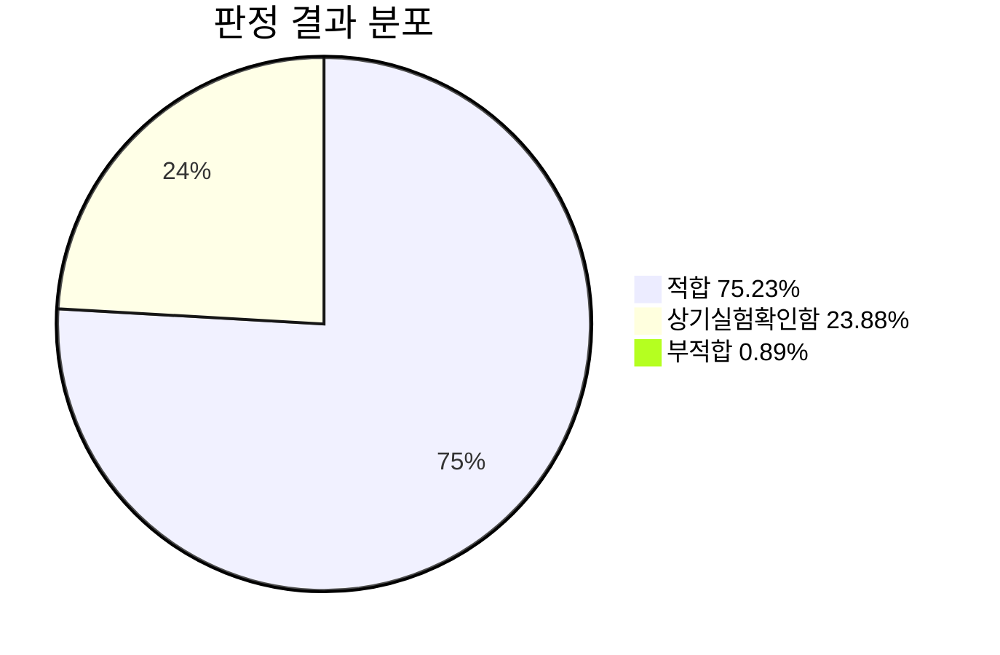
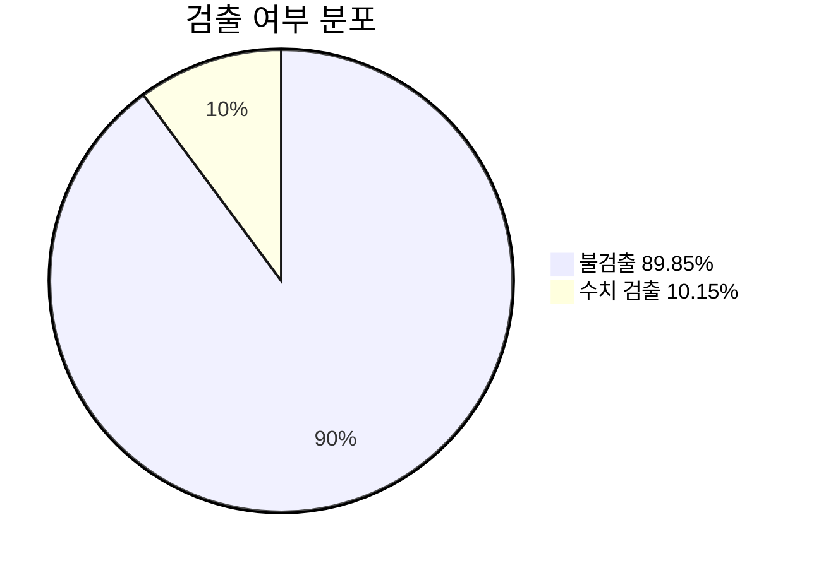
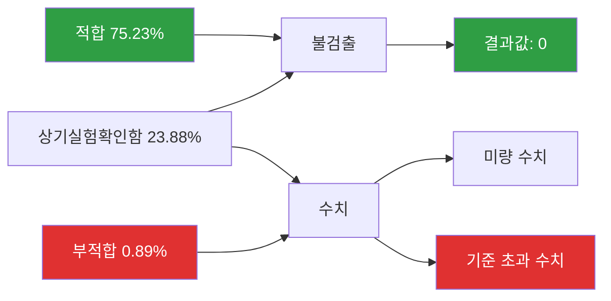
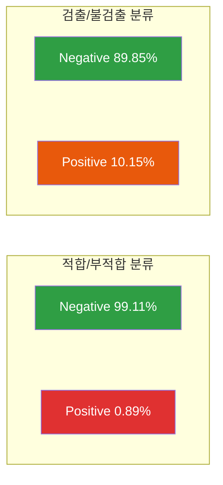
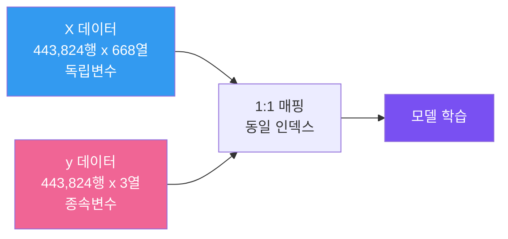

# y 데이터 설명서

> **파일명**: `df_통합_LIMS_기상정보_일조포함_결합_60일_gzip_y.pkl`  
> **형식**: gzip 압축 Pickle (pandas DataFrame)  
> **작성일**: 2026-04-09  

---

## 1. 개요

| 항목 | 값 |
|---|---|
| 행 수 | 443,824 |
| 열 수 | 3 |
| 인덱스 | 정수형 (0 ~ 443,823) |
| 데이터 타입 | `object` 3개 |
| 결측치 | 0 (전 컬럼 결측 없음) |
| 용도 | 아플라톡신 검출/부적합 예측을 위한 **종속변수(Target)** 데이터셋 |

---

## 2. 컬럼 상세 정의

| # | 컬럼명 | 한글명 | dtype | 고유값 수 | 결측치 | 설명 |
|---|---|---|---|---|---|---|
| 1 | `JDGMNT_WORD_NAME` | 판정문자명 | object | 3 | 0 | LIMS 검사 판정 결과 (적합/부적합/상기실험확인함) |
| 2 | `결과` | 결과 | object | 2 | 0 | 아플라톡신 검출 여부 (불검출/수치) |
| 3 | `결과값` | 결과값 | object | 3,792 | 0 | 아플라톡신 수치 측정값 (문자열 형태) |

---

## 3. 각 컬럼 상세

### 3.1 `JDGMNT_WORD_NAME` (판정문자명)

검사 시료에 대한 LIMS 공식 판정 결과이다.

| 값 | 건수 | 비율(%) | 설명 |
|---|---|---|---|
| 적합 | 333,866 | 75.23 | 기준 이내로 적합 판정 |
| 상기실험확인함 | 106,004 | 23.88 | 실험 결과 확인 완료 (별도 판정 없음) |
| 부적합 | 3,954 | 0.89 | 기준 초과로 부적합 판정 |

> **중요**: 부적합 비율이 0.89%로 극심한 클래스 불균형 상태이다. 이진 분류 모델 학습 시 오버/언더샘플링 등 불균형 대응 전략이 필수적이다.

---

### 3.2 `결과` (검출 여부)

아플라톡신의 검출 여부를 구분하는 이진 변수이다.

| 값 | 건수 | 비율(%) | 설명 |
|---|---|---|---|
| 불검출 | 398,807 | 89.85 | 아플라톡신 미검출 (정량 한계 미만) |
| 수치 | 45,017 | 10.15 | 아플라톡신 정량 검출 |

> **참고**: "수치"로 표기된 45,017건 중 실제 양성(기준 초과)은 `JDGMNT_WORD_NAME = 부적합`인 3,954건이다. 나머지는 검출되었으나 기준치 이내인 경우이다.

---

### 3.3 `결과값` (측정값)

아플라톡신 검사의 정량 측정값이다. **문자열(object) 타입**으로 저장되어 있다.

#### 값 분포 (상위 15개)

| 값 | 건수 | 비율(%) | 비고 |
|---|---|---|---|
| `0` | 398,807 | 89.85 | 불검출 = 0 |
| `0.00` | 8,490 | 1.91 | 소수점 표기 차이 |
| `0.0` | 5,645 | 1.27 | 소수점 표기 차이 |
| `0.1` | 2,463 | 0.55 | - |
| `0.000` | 2,384 | 0.54 | 소수점 자릿수 차이 |
| `0` (전각) | 2,239 | 0.50 | 전각/반각 차이 가능성 |
| `0.2` | 1,508 | 0.34 | - |
| `0.01` | 1,042 | 0.23 | - |
| `0.3` | 1,021 | 0.23 | - |
| `0.4` | 718 | 0.16 | - |
| `0.02` | 675 | 0.15 | - |
| `0.5` | 516 | 0.12 | - |
| `0.03` | 514 | 0.12 | - |
| `0.6` | 415 | 0.09 | - |
| `0.04` | 380 | 0.09 | - |

#### 데이터 품질 이슈

| 이슈 | 설명 |
|---|---|
| 문자열 타입 | 수치인데 object 타입으로 저장됨. `pd.to_numeric()` 변환 필요 |
| 0 표기 불일치 | `0`, `0.0`, `0.00`, `0.000` 등 다양한 표기가 혼재 |
| 비수치 값 존재 | `0..003` 등 오타로 추정되는 비수치 문자열 1건 발견 |

> **경고**: 수치 변환 전 `0..003` 같은 비수치 문자열 제거/교정이 필요하다.

---

## 4. 타겟 변수 활용 관점

### 4.1 이진 분류 (적합/부적합)

| 클래스 | 대상 컬럼 | 값 | 건수 | 비율(%) |
|---|---|---|---|---|
| Negative (적합) | `JDGMNT_WORD_NAME` | 적합 + 상기실험확인함 | 439,870 | 99.11 |
| Positive (부적합) | `JDGMNT_WORD_NAME` | 부적합 | 3,954 | 0.89 |

### 4.2 이진 분류 (검출/불검출)

| 클래스 | 대상 컬럼 | 값 | 건수 | 비율(%) |
|---|---|---|---|---|
| Negative (불검출) | `결과` | 불검출 | 398,807 | 89.85 |
| Positive (검출) | `결과` | 수치 | 45,017 | 10.15 |

### 4.3 회귀 (결과값 예측)

- `결과값` 컬럼을 수치형으로 변환하여 연속값 예측 가능
- 대부분(약 90%)이 0이므로 Zero-Inflated 분포에 해당

---

## 5. 3개 타겟 변수 간 관계

| JDGMNT_WORD_NAME | 결과=불검출 | 결과=수치 | 합계 |
|---|---|---|---|
| 적합 | 302,391 | 31,475 | 333,866 |
| 상기실험확인함 | 93,224 | 12,780 | 106,004 |
| 부적합 | 3,192 | 762 | 3,954 |

> **참고**: 부적합이면서 "불검출"인 3,192건은 아플라톡신 외의 다른 검사 항목에서 부적합 판정을 받았거나 데이터 매칭 시 발생한 것으로 추정된다.

---

## 6. X 데이터와의 관계

| 항목 | X | y |
|---|---|---|
| 행 수 | 443,824 | 443,824 |
| 인덱스 범위 | 0 ~ 443,823 | 0 ~ 443,823 |
| 행 순서 정합 | 동일한 순서로 1:1 매핑 |

X와 y는 같은 인덱스를 공유하며, 행 단위로 1:1 대응된다.

---

## 7. 비고

- 파일 압축 방식: gzip
- pandas `read_pickle(path, compression='gzip')` 으로 로드 가능
- 3개 컬럼 모두 `object` 타입이므로, 모델 학습 전 인코딩/수치 변환이 필수
- `결과값` 컬럼의 비수치 문자열(`0..003`) 사전 정제 필요
